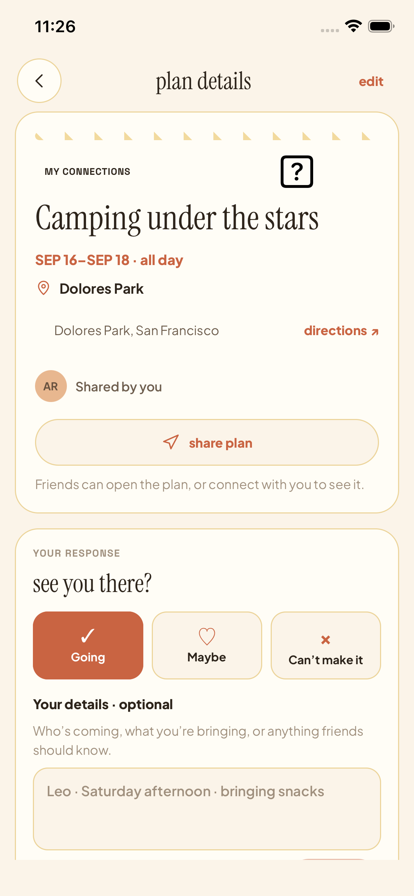
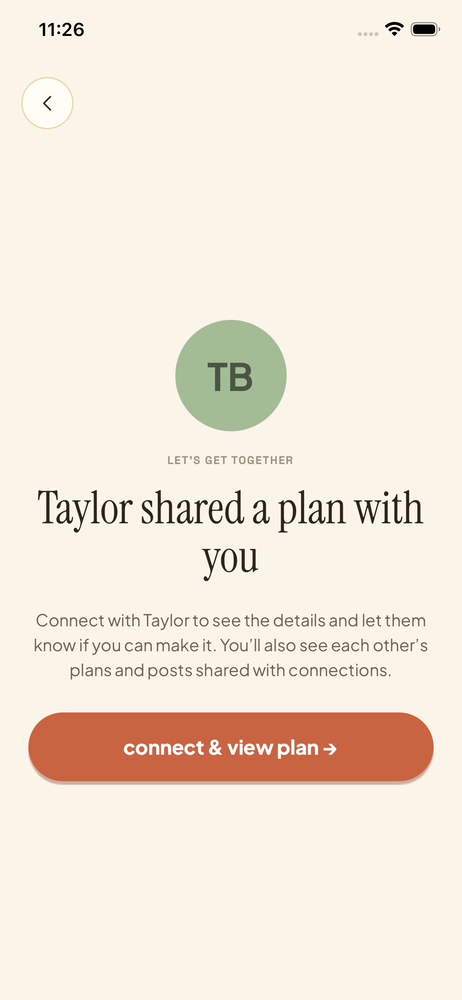
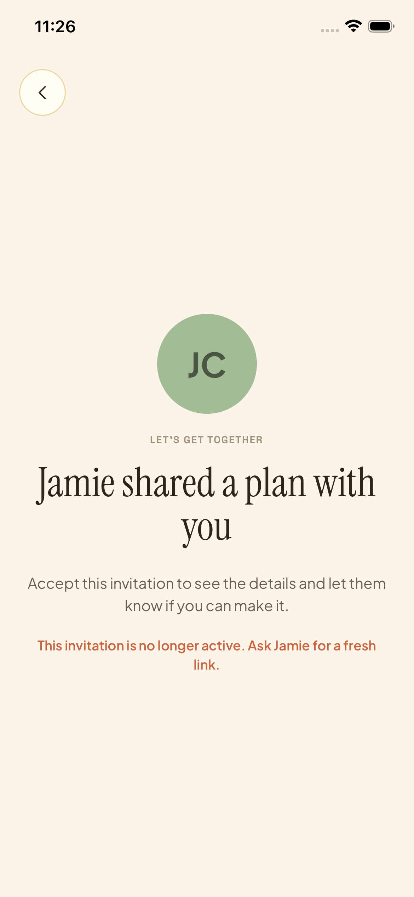

# Sharing a plan

A parent can send a plan they created from the **share plan** button on its detail
screen. The native share sheet includes the title and a stable HTTPS Village link.
No message is sent until the parent chooses a recipient and sends it in their app.

- A signed-in parent who can already see the plan opens its details directly.
- A new friend sees who invited them and chooses **connect & view plan**. This is
  an explicit mutual connection, with the normal connections-only posts and plans.
- For an invited-only plan, the creator's link is also an invitation to that
  particular plan. An existing connection without access chooses **accept & view
  plan**. Accepting never records an RSVP or signs anyone up with an organizer.
- Signed-out people sign in; incomplete profiles finish onboarding. Both return
  to the same invitation. The plan destination is bound to the token on the server,
  not supplied as a redirect parameter by the recipient.
- Only the creator can generate these connection invitations. Other participants
  cannot issue a connection invitation on the creator's behalf.

The existing `/join/<token>` HTTPS and `/invite/<token>` legacy app routes are
reused, including their Apple Universal Link association. `?plan=1` changes only
browser handoff copy. An old app can still accept the connection but will land on
its existing profile screen; the complete return-to-plan flow needs the new app.
People without Village receive the existing TestFlight-install-and-return guidance.
A general install link or automatic TestFlight enrollment is outside this change.

## Privacy and lifetime

The browser and unauthenticated preview reveal no plan title, location, time, or
family response. The preview retains the existing inviter identity and exposes
only the token-bound plan ID and the caller's access result. All actual plan data
still goes through existing RLS.

Links reuse the existing 30-day / 10-acceptance limits and can be revoked under
Your Village → invites. Repeated sharing reuses an active plan-specific link.
A general connection link is always separate from plan-specific invitations.
Deleting a plan deletes its invitations. Cancellation, publishing/ownership/audience
changes, and removing a private guest revoke previous plan links. Existing people
who retain access can still follow an expired or revoked link to their plan;
revocation prevents new acceptance, and never silently disconnects existing friends.
Blocked people cannot preview or accept the invitation.

Deploy migration `20260913000000_plan_share_links.sql` before distributing the
client, and deploy the scoped invite Worker for the browser copy. No additional
native entitlement or dependency is required.

## Acceptance checks

Node tests cover link construction, recipient routing, missing/expired states,
ordinary invite compatibility, browser escaping and privacy. SQL tests execute
all migrations under actual anonymous/authenticated PostgreSQL roles, covering
creator authorization, direct access, explicit acceptance, private-plan isolation,
blocked/expired/full links, revocation, guest removal, audience change and deletion.
Native fixture flows cover sharing/cancellation/errors, connected and new friends,
private invitations, sign-in/onboarding continuation and recovery. The fixture is
not a replacement for the SQL policy tests or physical-device Universal Link QA.

## Verified on September 13, 2026

- Typecheck and all 115 Node regression tests passed.
- All 24 unmodified migrations applied to ephemeral PostgreSQL, and all nine SQL
  suites passed, including invitation acceptance and guest removal through the
  actual authenticated plan-edit RPC.
- The HTTP fixture contract suite passed with the host time zone set to UTC.
- The complete sharing flow and sign-in/onboarding continuation passed on iPhone
  16e (iOS 26.3). On iPhone 17 Pro,
  sharing/cancellation, connected/new/private recipients, sign-in continuation,
  onboarding return and load-error recovery were also exercised. Screenshots were
  inspected for layout and controls; these tests use fictional accounts.
- The local browser handoff rendered correctly and preserved the fallback link.
  The Worker deployment dry run passed. No physical Messages → HTTPS Universal
  Link, Android runtime, or full VoiceOver audit was performed in this pass.

The native runner initially selected a background sign-out control, looked for
`Done` instead of `Done typing`, tapped a sign-in action below the keyboard, and
tried to center a form that already fit on
screen. Those driver steps were corrected. Error-retry buttons were also made
full width and rechecked; network failures retain a real retry action.

The simulator's existing emoji-font issue is visible in the share-control image;
its boxed question mark is the camping emoji, not a new sharing control.
